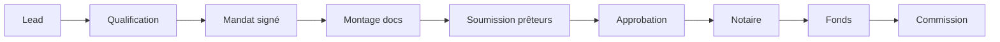

# Blueprint — Mode Courtier Immobilier & Prêts (v1)

> **Produit :** Plan Growth ERP — 2e vertical (`companies.vertical = 'agence'`, alias historique `'courtier'`)
> **Principe directeur :** même SaaS, même tenant, même qualité UI que Construction. Le mode Construction ne se redesigne pas.
> **Cible v1 :** courtier hypothécaire solo au Québec, titulaire d’un permis AMF, qui doit ouvrir un dossier demain matin.

---

## 1. Parcours courtier

Parcours concret pour un **courtier hypothécaire solo licencié AMF** (achat résidentiel au Québec). Chaque étape mappe vers une **phase Kanban** (`dossiers.phase`) et une **étiquette** (`dossiers.etiquette`).

### 1.1 Lead → qualification

| Étape métier | Dans l’ERP v1 | Actions courtier |
|---|---|---|
| Lead entrant (site, référence, pub Meta) | `leads` (module Acquisition réutilisé) ou création directe depuis `/dossiers` | Capturer nom, téléphone, courriel, source |
| Premier contact | `clients` (libellé **Emprunteurs** en nav agence) + note journal | Appel découverte : projet, échéance, capacité |
| Qualification (besoin réel, faisabilité grossière) | Dossier créé, `phase = prise_en_charge`, `etiquette = qualification_initiale` | Estimer montant cible, type transaction |
| Mandat / autorisation | `etiquette = mandat_signé` | Mandat de courtage signé (PDF externe v1 ; checklist « reçu » dans notes) |

**KPI solo :** nombre de leads qualifiés / semaine, délai lead → mandat.

### 1.2 Montage du dossier

| Étape métier | Dans l’ERP v1 | Actions courtier |
|---|---|---|
| Demande pièces | `phase = montage`, `etiquette = documents_demandes` | Liste pièces standard QC (revenus, T4/Relevé 1, avis cotisation, relevés bancaires, pièce ID) |
| Réception pièces | `etiquette = documents_recus` | Marquer pièces reçues (checklist v1, pas de GED lourde) |
| Analyse crédit / ratios | `etiquette = dossier_complet` | Saisir montant, taux cible, notes internes |
| Propriété identifiée | champ `notes` + lien client | Adresse propriété en notes v1 ; table propriété v2 |

**KPI solo :** dossiers complets prêts à soumettre, jours en montage.

### 1.3 Soumission multi-prêteurs

| Étape métier | Dans l’ERP v1 | Actions courtier |
|---|---|---|
| Sélection prêteurs | `preteurs` (répertoire) + `dossiers.preteur_id` (prêteur retenu / principal) | Comparer banque vs caisse vs monoline |
| Soumission | `phase = soumission`, `etiquette = soumis_aux_preteurs` | Soumission via portails prêteurs (externe v1) |
| Suivi réponses | `etiquette = reponses_recues` | Noter taux, conditions, refus |

**Limite v1 :** une seule FK `preteur_id` par dossier ; pas de table « offres concurrentes » (v2).

### 1.4 Offre → approbation

| Étape métier | Dans l’ERP v1 | Actions courtier |
|---|---|---|
| Offre retenue | `devis` (menu **Offres**) optionnel v1 | Document formel « offre » si nécessaire |
| Approbation conditionnelle | `phase = approbation`, `etiquette = approbation_conditionnelle` | Lister conditions en `notes` |
| Conditions remplies | `etiquette = conditions_remplies` | Checklist manuelle |
| Approbation finale | `etiquette = approbation_finale`, `date_approbation` | Engagement prêteur confirmé |

### 1.5 Notaire → fonds → commission

| Étape métier | Dans l’ERP v1 | Actions courtier |
|---|---|---|
| Instructions notaire | `phase = finalisation`, `etiquette = en_notariat`, `date_notariat` | Date acte visée |
| Signature acte | `etiquette = acte_signe` | — |
| Déblocage fonds | `etiquette = fonds_debloques`, `date_cloture` | Confirmer financement |
| Commission | `commissions` + `etiquette = commissionne`, `commission_brute` sur dossier | Saisir montant attendu / reçu |
| Clôture | `phase = finalisation`, `etiquette = ferme` | Archiver dossier |

**KPI solo (dashboard agence v1) :** volume pipeline ($), commissions à recevoir / reçues (30j), dossiers actifs par phase, délai moyen mandat → fonds.

---

## 2. Modules / menus / vocabulaire vs Construction

| Module Construction (`NAV_CONSTRUCTION`) | Équivalent Courtier (`NAV_AGENCE`) | Stratégie |
|---|---|---|
| Dashboard | Dashboard (KPIs différents si `vertical = agence`) | **Réutiliser** page, **brancher** requêtes par vertical |
| Acquisition | Acquisition | **Réutiliser** tel quel |
| Contenu IA | Contenu IA | **Réutiliser** tel quel |
| Leads / CRM | *(absent du nav agence)* — leads via Acquisition | **Réutiliser** tables `leads`, masqué du nav courtier v1 |
| Chantiers (`/jobs`) | Dossiers Prêts (`/dossiers`) | **Nouveau** domaine ; pattern UI calqué sur kanban jobs |
| Calendrier | Calendrier | **Étendre** : ajouter événements dossiers (dates clés) |
| Clients | Emprunteurs (`/clients`, même route) | **Réutiliser** table `clients` + i18n nav |
| Employés | *(absent nav agence)* | Construction only — **ne pas modifier** |
| Sous-traitants | *(absent)* | Construction only |
| Conformité QC (CCQ, retenues, SEAO) | *(absent nav agence)* | Construction only |
| Devis | Offres (`/devis`, même route) | **Réutiliser** module devis ; libellé nav seulement |
| Factures | Factures | **Réutiliser** |
| Dépenses | Dépenses | **Réutiliser** |
| Ventes / Rapports / Marché | Ventes / Rapports / Marché | **Réutiliser** ; rapports courtier v2 |
| Paramètres | Paramètres | **Étendre** onglet Secteur & Mode + champ AMF |
| Prêteurs | Prêteurs (`/preteurs`) | **Nouveau** |
| Commissions | Commissions (`/commissions`) | **Nouveau** |
| Admin SaaS / Abonnés | Idem | Plateforme — inchangé |

**Bascule de mode :** `POST /api/me` avec `{ vertical: 'agence' | 'construction' }` — normalise `courtier` → `agence`.

---

## 3. Modèle de données cible

### 3.1 Drift (BUG connu)

Trois définitions coexistent. **Canonique v1 = UI + `schema-agence.sql`**, pas `courtier_tables.sql`.

| Aspect | `courtier_tables.sql` | `schema-agence.sql` + UI/API | Décision v1 |
|---|---|---|---|
| Type prêt | `type_pret` | `type_transaction` | **`type_transaction`** |
| Montant | `montant` | `montant_pret` | **`montant_pret`** |
| Sous-statut | *(absent)* | `etiquette` | **`etiquette`** |
| Commission dossier | *(absent)* | `commission_brute`, `taux_commission` | **Garder** |
| Taux prêt | `taux` | *(absent UI)* | **`taux` nullable** |
| Dates | `date_soumission`, `date_approbation`, `date_financement` | + `date_notariat` | **Union** + `date_cloture` |
| Numéro | trigger `DOS-YYYY-0001` | `DOS-YYMMDD-RAND` | **Trigger séquentiel `DOS-YYYY-0001`** |
| Commission statut | `en_attente`, `reçue`, `annulée` | `a_recevoir`, `recu`, `annule` | **Valeurs UI** |
| Commission dates | `date_paiement` | `date_prevue`, `date_recue` | **`date_prevue` + `date_recue`** |
| Prêteur type | `'privé'` | `'prive'`, `'autre'` | **sans accent** |

**Migration :** `0015_align_courtier_schema.sql` — idempotente, ne pas écraser `courtier_tables.sql`, ne pas toucher aux tables Construction.

### 3.2 `companies` (extensions v1)

| Colonne | Type | Notes |
|---|---|---|
| `vertical` | text | `'construction' \| 'agence'` (normaliser `courtier` → `agence`) |
| `numero_amf` | text nullable | permis courtier hypothécaire |
| `amf_expiration` | date nullable | rappel calendrier |
| `courtier_type` | text default `'solo'` | check `solo`, `agence` |

### 3.3 `preteurs`

Colonnes existantes : `id`, `company_id`, `nom`, `type`, `contact_nom`, `contact_email`, `contact_tel`, `notes`, `actif`, `created_at`.

CHECK `type` : `banque`, `caisse`, `prive`, `assureur`, `autre`.

RLS : `company_id = get_my_company_id()`. Index `(company_id)`.

### 3.4 `dossiers` (colonnes cibles)

| Colonne | Type | Notes |
|---|---|---|
| `id` | uuid PK | |
| `company_id` | uuid NOT NULL → companies | |
| `client_id` | uuid → clients SET NULL | Emprunteur principal |
| `preteur_id` | uuid → preteurs SET NULL | Prêteur retenu |
| `assigned_to` | uuid → profiles SET NULL | courtier responsable |
| `numero` | text NOT NULL unique (company_id, numero) | |
| `phase` | text default `prise_en_charge` | `prise_en_charge`, `montage`, `soumission`, `approbation`, `finalisation` |
| `etiquette` | text default `nouveau_lead` | snake_case |
| `type_transaction` | text default `achat` | `achat`, `renouvellement`, `refinancement`, `transfert` |
| `montant_pret` | numeric(14,2) | |
| `taux` | numeric(5,3) | taux hypothécaire % |
| `taux_commission` | numeric(6,4) | |
| `commission_brute` | numeric(12,2) | |
| `date_soumission` | date | |
| `date_approbation` | date | |
| `date_notariat` | date | |
| `date_cloture` | date | fonds / clôture |
| `notes` | text | |
| `created_at` / `updated_at` | timestamptz | trigger updated_at |

Trigger numéro : `DOS-YYYY-0001`.

### 3.5 `commissions`

| Colonne | Type | Notes |
|---|---|---|
| `id` | uuid PK | |
| `company_id` | uuid | |
| `dossier_id` | uuid → dossiers SET NULL | |
| `preteur_id` | uuid → preteurs SET NULL | |
| `montant` | numeric(14,2) NOT NULL | |
| `statut` | text default `a_recevoir` | `a_recevoir`, `recu`, `annule` |
| `date_prevue` | date | |
| `date_recue` | date | |
| `notes` | text | |
| `created_at` | timestamptz | |

### 3.6 Tables réutilisées (pas de changement schéma v1)

`clients`, `leads`, `devis`, `factures`, `depenses`, `notes`, `profiles`, `invitations`, `subscriptions`.

### 3.7 TROUS — v1 vs v2

| Trou | v1 | v2 |
|---|---|---|
| Documents | **Oui** — `dossier_documents` checklist | GED / OCR |
| Conditions | etiquette + notes | table dédiée |
| Offres multi-prêteurs | Non — un `preteur_id` | `dossier_offres` |
| Co-emprunteurs | Non — notes | table dédiée |
| AMF | champs companies | formation continue |
| Renouvellements | `type_transaction` | workflow auto |
| Split commission | Non | `commission_splits` |
| Assignation collab | **Oui** — `dossier_assignments` | permissions granulaires |
| Fiche `/dossiers/[id]` | **Oui** | portail emprunteur |
| Filogix / Velocity | Non | v2+ |

### 3.8 `dossier_assignments`

Calquée sur `job_assignments` : `company_id`, `dossier_id`, `profile_id`, unique `(dossier_id, profile_id)`. RLS tenant + admin CRUD.

### 3.9 `dossier_documents`

`type` : `t4`, `releve1`, `avis_cotisation`, `releve_bancaire`, `piece_id`, `mandat`, `promesse_achat`, `evaluation`, `autre`. Champs : `titre`, `recu` boolean, `file_url` nullable, `notes`.

RLS : `company_id = get_my_company_id()`.

---

## 4. Écrans et API routes

### Existant à étendre

| Route | Extension | Auth |
|---|---|---|
| `GET/POST/PATCH /api/dossiers` | Colonnes §3.4 ; numéro via trigger | `requireCompany` |
| `GET/POST/PATCH /api/preteurs` | enum type ; POST admin | GET `requireCompany` ; mutations `requireCompanyAdmin` |
| `GET/POST/PATCH /api/commissions` | mutations admin | GET `requireCompany` ; mutations `requireCompanyAdmin` |
| Dashboard | KPI agence si vertical=agence | |
| `/clients` | libellé Emprunteurs | |
| `/devis` | libellé Offres | |
| Paramètres | champs AMF si agence ; cacher RBQ | |
| `permissions.ts` + `middleware.ts` | collab courtier → `/dossiers` | |

### Nouveau v1

| Méthode | Path | Rôle |
|---|---|---|
| GET/PATCH | `/api/dossiers/[id]` | `requireCompany` |
| DELETE | `/api/dossiers/[id]` | `requireCompanyAdmin` |
| GET/POST | `/api/dossiers/[id]/documents` | `requireCompany` |
| PATCH | `/api/dossiers/[id]/documents` | `requireCompany` |
| GET/POST/DELETE | `/api/dossier-assignments` | `requireCompanyAdmin` |
| page | `/dossiers/[id]` | fiche dossier |

### KPI dashboard courtier

| KPI | Requête |
|---|---|
| Pipeline actif ($) | sum `montant_pret` dossiers non fermés |
| Commissions à recevoir | sum `commissions.montant` `a_recevoir` |
| Commissions reçues 30j | sum `recu` + `date_recue` 30j |
| Dossiers actifs | count non fermés |

Ne pas remplacer les KPI Construction.

---

## 5. Conformité QC (flags produit, pas de conseil juridique)

- AMF : `numero_amf`, `amf_expiration`, rappel calendrier 90/30/7 j.
- Loi 25 : réutiliser onglet Confidentialité existant ; pas de NAS structuré.
- Pièces : checklist `dossier_documents`.
- Fiscal : commissions souvent TPS sans TVQ — réutiliser `lib/api/fiscal.ts` plus tard.

---

## 6. Hors-scope

**v1 :** bascule mode, nav, CRUD prêteurs, pipeline + fiche dossier, emprunteurs, commissions admin, checklist docs, AMF, dashboard KPI, permissions collab, alignement SQL/UI.

**v2 :** multi-offres, co-emprunteurs, split, portail, Filogix, rapports dédiés, module inscriptions immobilières, OCR.

---

## 7. Permissions

| Rôle | Courtier v1 |
|---|---|
| owner / admin | tout |
| collaborateur | `/dossiers`, `/clients`, `/calendrier`, `/parametres` (lecture org) |
| collaborateur interdit | `/commissions`, `/preteurs` (mutations), `/devis`, `/factures`, `/depenses`, `/dashboard`, `/acquisition`, `/admin` |

GET `/api/dossiers` filtre par `dossier_assignments` si collaborateur.

Construction : collab reste `/jobs` + calendrier + parametres. Brancher sur `companies.vertical`.

---

## 8. Fichiers Construction à ne pas modifier

`app/(app)/jobs/**`, `app/api/jobs/**`, `job-assignments`, sous-traitants, employes, conformite, `NAV_CONSTRUCTION` items, KPI construction, tables `jobs` / `qc_*`, tests RBQ/CCQ.

---

## 9. Seed prêteurs QC (manuel, jamais auto prod)

Banque Nationale, RBC, TD, BMO, Scotia, CIBC, Laurentienne, Manulife, Desjardins, First National, MCAP, RFA, Equitable Bank, Home Trust, HSBC.

---

## 10. Ordre d’exécution

1. Migration `0015_align_courtier_schema.sql`
2. APIs dossiers/preteurs/commissions + `[id]` + documents + assignments
3. Lib `lib/agence/`
4. Fiche `/dossiers/[id]` + Kanban + prêteurs + commissions
5. Permissions + middleware
6. Dashboard branche agence
7. Paramètres AMF / cacher RBQ
8. Tests

## 11. Glossaire

| Construction | Courtier | Route |
|---|---|---|
| Chantier | Dossier prêt | `/dossiers` |
| Client | Emprunteur | `/clients` |
| Devis | Offre | `/devis` |
| Mode Chantiers | Mode Immobilier | paramètres |
